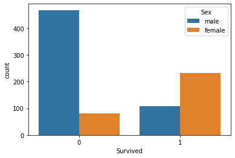
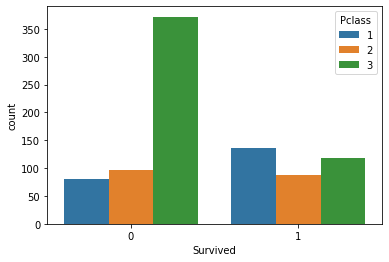
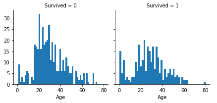
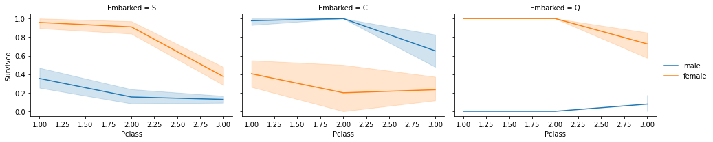
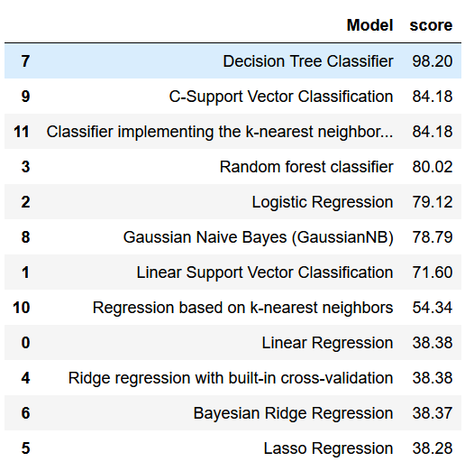

## Titanic - Machine Learning from Disaster
Start here! Predict survival on the Titanic and get familiar with ML basic

Data Scource for this code is from <a href="https://www.kaggle.com/c/titanic/data"> kaggle 

## Score
- 1st trial : 0.40430
- 2nd trial : 0.73444
- 3rd trial : 0.76794
- 4th trial : 0.77990 (Top 26%)

Data Dictionary 
-----------------------

Variable    |  Definition                                | Key
----------- | ------------------------------------------ | -------------
survival    |  Survival                                  | 	0 = No, 1 = Yes
pclass      |  Ticket Class                              | 	1 = 1st, 2 = 2nd, 3 = 3rd
sex         |  Sex                                       |
Age         |  Age of years                              |
sibsp       | # of siblings / spouses aboard the Titanic |
parch       | # of parents / children aboard the Titanic |
ticket      | 	Ticket number                            |
fare        | 	Passenger fare                           |
cabin       | 	Cabin number                             |
embarked    | 	Port of Embarkation                      | 	C = Cherbourg, Q = Queenstown, S = Southampton

## Summary based on Data

- Female has more survived rate than male

- 3rd ticket class holder have more death than other ticket holders

- Most death around age 20~40
- Least death around 0-15 and 60-80

- Unlike other port of Embarkation, Male survived more than female in Cherbourg.

## Model Score for different types of ML

Based on Different types of machine learning, decision tree classifier has best score

Even though Decision tree classifier gives best score, C-Support Vector Classification gives best score in actual submission.
